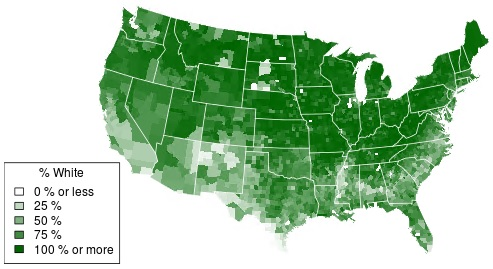

## Census Data

You have this census data...

```{r}
counties <- readRDS("data/counties.rds")
head(counties)
```

--- .class #id 

## Now What?

It's not very easy to see what's going on when the data is just displayed in a table format

<div style='text-align: center;'>
    
</div>

--- .class #id 

## Imagine

But what if we had a way to visualise this data

<div style='text-align: center;'>
    
</div>

--- .class #id 

## Visualise

Introducing the Census Visualisation App

<div style='text-align: center;'>
    
</div>

Click <a href="https://geloofy.shinyapps.io/census-app">here</a> to try it now!
